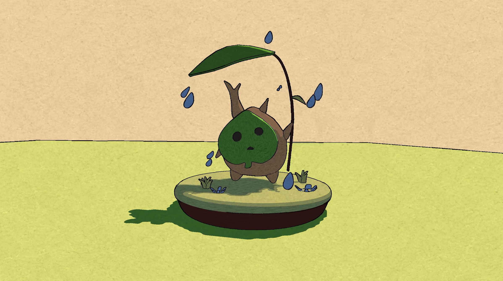
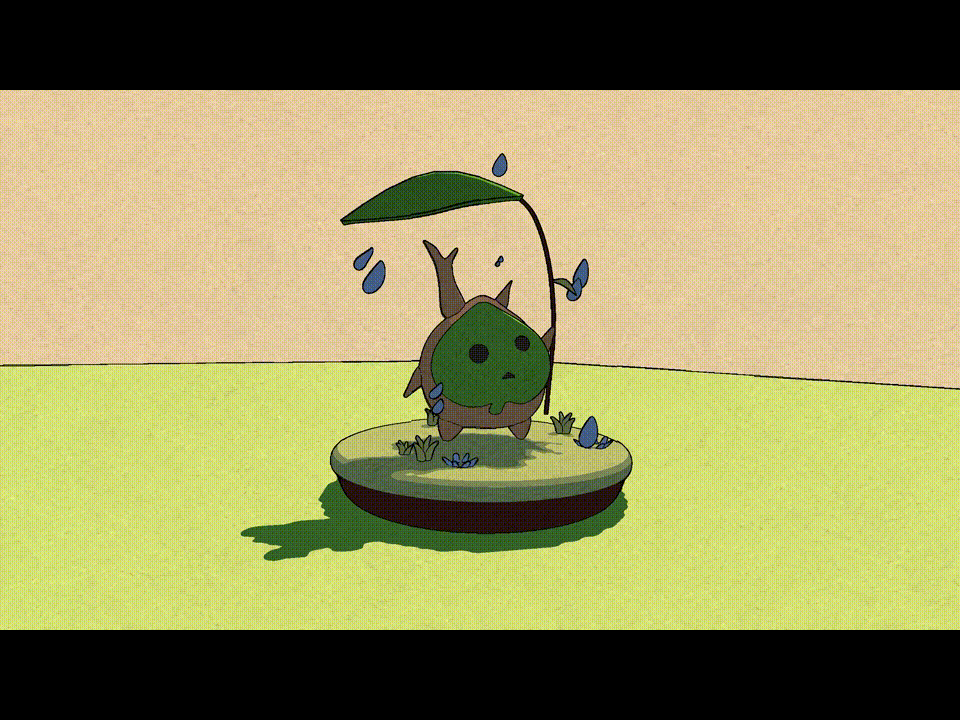
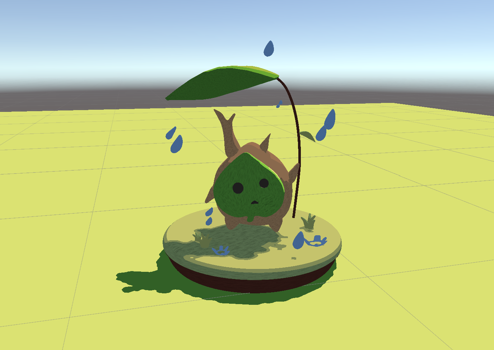

# HW 2: *3D Stylization*
Author: Ziqiu Wang

## Project Summary

Here are the GIF versions of some turnaround videos:

Simple turnaround:

Turnaround with effects turned on and off (wobbling outline, paper effect, old-movie effect):

Many of the effect parameters are customizable.

### Concept Art Chosen

### Interesting Shaders

I implemented a three-tone toon shader with main directional and additional light support, adjustable specular highlights, and a custom "sketchy" shadow texture that makes the scene look hand-drawn. The shadow pattern is sampled with object UVs and has an adjustable scale so that it can conform to each mesh. Another special version of this surface shader also applies small stepped vertex jitter to give the objects an interesting wobble.

### Outlines

I used Sobel Cross filters in a full-screen outline pass (achieved through Render Features) to detect edges from separate depth and normal buffers. The depth-based outline does a small interval-based wobble, while the normal-based outline remains still to add a little bit of stability. The outline width, depth and normal thresholds for the filters, wobble intensity, wobble speed (how many wobbles per second), and wobble spatial frequency are exposed and adjustable. The intent of the design is again to create a hand-drawn visual effect. 

### Full Screen Post Process Effect

A second full-screen pass applies a paper-like texture over the rendered scene to further make the final image resemble a traditional drawing. The paper texture's scale, strength of the effect, paper tint, and desaturation level are exposed and adjustable.

### Scene Created
The scene features a cute Korok (from The Legend of Zelda: Breath of the Wild, of course) holding a leaf in its hand as an umbrella, with separate small meshes for raindrops and grass. The meshes were downloaded from the [Rainy Korok model on Sketchfab](https://sketchfab.com/3d-models/rainy-korok-1969a8dcb90e49a28bc5eedc24df653b).

### Interactivity

Pressing the Space bar toggles between the original paper look and a black-and-white old-movie one (should probably call it "motion picture"). This is achieved through a C# file which swaps the render feature's material at runtime, while a new shader adds desaturation, strong contrast, and a vignette texture that darkens the corners to create the vintage effect.